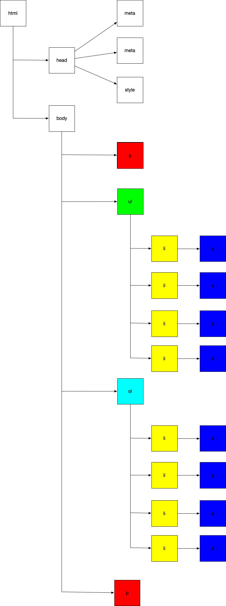

# Adjacent Session — June 3, 2020

## Contents <!-- omit in toc -->

- [What is a tag (in HTML)?](#What-is-a-tag-in-HTML)
- [What does HTML stand for?](#What-does-HTML-stand-for)
- [What is HyperText and how is it different from, uh...non-hyper text?](#What-is-HyperText-and-how-is-it-different-from-uhnon-hyper-text)
- [Name Some HTML Tags](#Name-Some-HTML-Tags)
- [HTML Documents Are A Map, Not The Terrain](#HTML-Documents-Are-A-Map-Not-The-Terrain)
- [CSS Selectors](#CSS-Selectors)
- [Trees!](#Trees)

## What is a tag (in HTML)?

- If you say a certain word, it will do a certain thing. It's very directional, like a command to the computer/browser.
- You can use tags to edit text / change how text appears (in a browser)
- It's used to indicate a type of HTML element

## What does HTML stand for?

- HTML — **H**yper**T**ext **M**arkup **L**anguage
- HTTP — **H**yper**T**ext **T**ransfer **P**rotocol
- The `href` in `<a href="...">...</a>` — **H**yperText **R**eference

## What is HyperText and how is it different from, uh...non-hyper text?

With a physical book, to cite another book you have to embed the text directly in the book and/or include a reference to its name.

There are also many copies of the same text. If I write a book and update it, the old copies still exist.

With hypertext, everything is referred to by its location. The document *is* the citation. Hypertext documents can point directly to other hypertext documents in a uniform way.

We use URLs to do this. URL stands for **U**niform **R**esource **L**ocator.

Some classic texts have their own *ad hoc* "uniform resource locators", so to speak. There's a standard way to refer to a particular verse in the Bible or Quran. The works of Aristotle have their own standard reference system called [Bekker numbers](https://en.wikipedia.org/wiki/Bekker_numbering).

Hypertext documents form a web of connected documents. Document A points to Document B which points to Document C which points back to Document A and so on. It's a living thing.

For this reason, the `<a>` tag is really the at the heart of HTML. It's what allows one hypertext document to point to another hypertext document. Everything else is window dressing.

## Name Some HTML Tags

- `<a>`
- `<html>`
- `<em>`, `<head>`, `<body>`, `<p>`
- `<h1>`, `<h2>`, `<h3>`, ..., `<h6>`
- `<br>`
- ``
- `<table>`, `<tr>`, `<th>`, `<td>`
- `<video>`, `<audio>`
- `<style>`
- `<ul>`, `<ol>`, `<li>`
- `<title>`
- `<div>`

## HTML Documents Are A Map, Not The Terrain

HTML documents describe a nested, tree structure (like a family tree). Opening and closing tags denote the start and end of a new branch of the tree.

This is why CSS selectors use language like "child", "sibling", and "descendent."

Look at [index.html](index.html). You can see it live at <http://adjacent-sessions-20200603.surge.sh>.

Convince yourself that the HTML in `index.html` and the following image of a tree are two pictures of the same thing:



## CSS Selectors

This CSS:

```css
ul > li > a {
  color: green;
}

ol > li > a {
  color: red;
}
```

Is saying two things:

1. Select all the `a` tags that are **children** of a `li` tag that are **children** of a `ul` tag and apply the following styles: `color: green`
1. Select all the `a` tags that are **children** of a `li` tag that are **children** of a `ol` tag and apply the following styles: `color: red`

This is why the `>` is called the "child combinator":
- `a` selects all the `<a>...</a>` tags on the page
- `li` selects all the `<li>...</li>` tags on the page
- `li > a` selects all the `<a>` tags that are a **child** of an `<li>` tag

We are **combining** two selectors into a more specific selector. Not *every* `<a>` tag, only those that are a child of an `<li>` tag.

A CSS declaration like:

```css
ol li p {
  color: purple;
}
```

Selects `ol li p`, which is all the `<p>` tags that are **descendents** of an `<li>` tag that are **descendants** of an `<ol>` tag. A space alone is a "descendent combinator".

## Trees!

The important things are:

1. An HTML document describes a tree
1. The selector portion of a CSS declaration singles out some parts of the tree and we use tree-like language to describe what is happening (child, descendent, sibling, etc.)
1. Once selected, we apply the styles/properties specified between the brackets `{ ... }`
