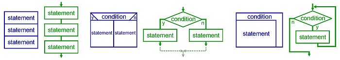

# Adjacent Session, June 16, 2020

## Variable Assignment

When we write something like

```js
name = 'Jesse';
age = 36;
```

what we are saying is:

1. "Set the value of the variable `name` to `'Jesse'`"
1. "Set the value of the variable `age` to `36`"

When we write something like:

```js
count = 10
count = count + 1
```

What we are saying is:

1. "Set the value of the variable `count` to `10`"
1. "Set the value of the variable `count` to (the value of `count + 1`"

The net effect of a statement like `count = count + 1` is to increment the value of `count` by `1`.

Do *not* think of `=` as being the same thing from math class. It's called the "assignment operator". There's a built in right-to-left motion happening in time: the right side is calculated first and then the variable referenced on the left hand side takes on that value.

Some languages use `<-` as assignment, which is maybe more evocative.

## Control Flow

There are three main types of control flow:

1. Sequence
1. Conditional / Branching
1. Looping

Sequence is when the computer performs one instruction after the other.

Branching is when the computer looks at some information to decide whether it should run one block of code or another (but not both).

Looping / iteration is when a computer runs the same block of code over and over until some condition is met.



## Conditionals

Run the folliwing code and see if you can't predict what it will output. Experiment with it, change parts, try to investigate what's happening.

```js
let age = 20;
console.log('Age is:', age);

let otherAge = 90;
console.log('otherAge is:', otherAge);

let bleep = Math.min(age, otherAge);
console.log('The value of bleep is:', bleep);

if (bleep < 40) {
  console.log('Hello there youngster');
} else {
  console.log('nice try');
}
```

## Loops

Run the following three examples and see if you can't make sense of what's happening. The `while (condition) { ... }` syntax means: "Run the code between the `{ ... }` until `condition` is `true`."

### Loop Example 1

```js
let count = 0;

console.log('Before loop:', count);
console.log('--------------------');

while (count < 5) {

  console.log('Start of loop:', count);
  count = count + 1;
  console.log('End of loop:', count);
  console.log('--------------------');

}

console.log('After loop:', count);
```

### Loop Example 2

```js
let count = 0;

while (count < 20) {
  console.log('The value of count is:', count);
  count = count + 2;
}
```

### Loop Example 3

```js
let numbers = [10, 20, 30, 40];

console.log('The length is:', numbers.length);

let i = 0;
while (i < numbers.length) {
  console.log('The i is:', i);
  console.log('The value is:', numbers[i]);
  console.log('-------------------');

  i = i + 1;
}

console.log('All done!');
```
