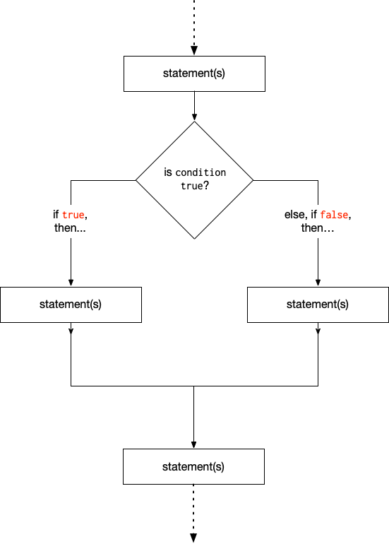

# Session Notes: code-predictions

## Tuesday, September 22, 2020

Make predictions!

There are several files in here: `prediction-1.js`, `prediction-2.js`, ..., etc.

1. Read each one
1. Make a prediction about what they'll print out when run
1. Compare your predictions to what you observed
1. Use your "surprise" to focus in on the concepts or syntax that you're confused about

Most folks get tripped up by how functions work.

- See <https://github.com/jfarmer/intro-javascript/tree/master/Functions> for more about functions
- See <https://github.com/jfarmer/diagnostics-javascript-i> for all the diagnostics

Here's a diagram representing how branching works:

