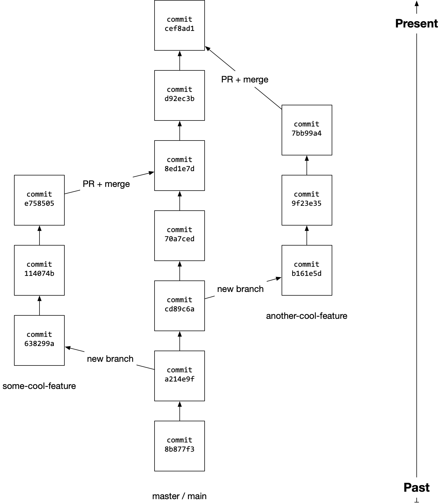

# Session Notes: Pull Requests

## Wednesday, October 14, 2020

## Contents <!-- omit in toc -->

- [Wednesday, October 14, 2020](#wednesday-october-14-2020)
- [A Diagram Of A Git Repository w/ Branches](#a-diagram-of-a-git-repository-w-branches)
- [What Are Pull Requests?](#what-are-pull-requests)
  - [Pull Requests](#pull-requests)
  - [Branches](#branches)
- [The Steps™](#the-steps)
  - [Create New Branch](#create-new-branch)
  - [Switching Branches](#switching-branches)
  - [Checking Current Branch](#checking-current-branch)
  - [Pushing to GitHub](#pushing-to-github)

## A Diagram Of A Git Repository w/ Branches

The sections that come after this will help this diagram make more sense.



## What Are Pull Requests?

Imagine you're working on a product with 10 other people. At any given moment in time, there might be many.

Branches + pull requests are big part of managing this process. They allow separate contributors (or separate teams of contributors) to work on different features without interfering with other people's work or leaving the main `master` branch in a broken state.

### Pull Requests

Pull requests (sometimes called a merge request) is act of requesting that code from one branch be pulled into (or merged into) another branch. I might create a separate branch where all my work related to a new feature goes. When I feel like that feature is ready for feedback or ready to merge into the main project, I would create a pull request on GitHub.

This creates a place for other folks to look at and give feedback on the changes my feature would introduce, line by line on GitHub.

- Collaborating with other people
- Somehow sharing code between repositories or copies of the same repository
- Allows you to pull code down without changing the main branch or some other branch
- Somehow involves branches? What are those?

### Branches

Branches are a bit like a parallel universe or like a "fork" within your own repository. Every branch has a name

- Tsega-Ab watched a video about GitHub
- Creates a separate "branch" of the same code so you can edit it without messing up the original
- When you're happy with the changes you can merge it

## The Steps™

1. Create a new branch
1. Do work on that new branch
1. (Know how to check which branch you're on)
1. Make commits on that new branch
1. Push branch up to GitHub
1. Create pull request (PR) on GitHub
1. Comment, feedback, merge PR into `master`
1. Pull down newly-merged changes from GitHub onto your local machine

### Create New Branch

The default branch is called `master`. When in a git repository, there's always an "active" branch.

You can create new branches and switch between existing branches. To create a new branch and switch to that branch, you can do it in two steps:

```console
git branch cool-new-branch    # Create new branch
git checkout cool-new-branch  # Switch to new branch
```

Or the following command will create and switch in one go:

```console
git checkout -b cool-new-branch
```

### Switching Branches

You can use `git checkout` to switch branches.

```console
git checkout best-feature-ever  # Switch to 'best-feature-ever' branch
git checkout master             # Switch to 'master' branch
```

### Checking Current Branch

Ideally, your terminal prompt is set up to indicate the current branch, but you can always run the following command to list all the branches and see which one is active:

```console
git branch
```

Example output:

```console
$ git branch
  another-amazing-feature
  first-feature
* master
$
```

This output tells us:

1. There are three branches: `master`, `first-feature`, and `another-amazing-feature`
1. We currently have the `master` branch checked out (indicated by the `*`)

After using `git checkout` to switch branches:

```console
$ git checkout first-feature
Switched to branch 'first-feature'
$ git branch
  another-amazing-feature
* first-feature
  master
$
```

### Pushing to GitHub

A branch only lives in your local computer until you use `git push` to send it to GitHub.
