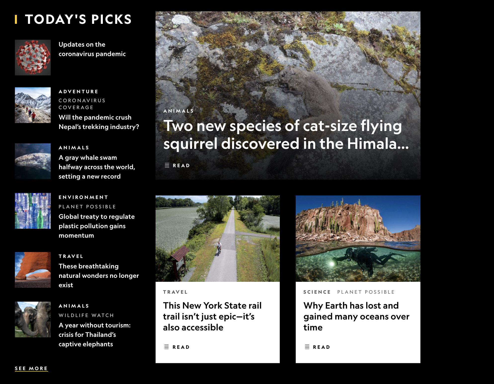

# Session Notes: Layouts, Grids

<!-- omit in toc -->
## Wednesday, June 9, 2021

<!-- omit in toc -->
## Contents

- [Files](#files)
- [Boxes, Layouts, and Wireframes](#boxes-layouts-and-wireframes)

## Files

See `index.html` or visit the live version at <https://jesse-session-2021-06-09.surge.sh>

## Boxes, Layouts, and Wireframes

Every design has many layers of structure, regardless of medium. A newspaper has well-defined sections that stand in relation to one another, waiting for content to arrive. The content in each section varies from day to day, but the overall structure remains the same.

In 2-dimensional media, we often organize things in terms of grids and boxes. We don't *have* to, but it helps if the design involves communicating information.

The web is no different.

You want to have an idea of the high-level layout of your page before you start. What are the main sections? How are the positioned relative to each other? How are they related? Is it important two sections are always aligned with each other? Are the same size, or maintain the same size relationship?

Look at <https://www.nationalgeographic.com/>.

Here's a screenshot:

What are the main boxes in the layout? Sketch it out.

Always have an idea of what you WANT your design to look like before you dive into HTML and CSS. Your HTML will reflect the structure of your design. Your CSS will make it look like you intend.
